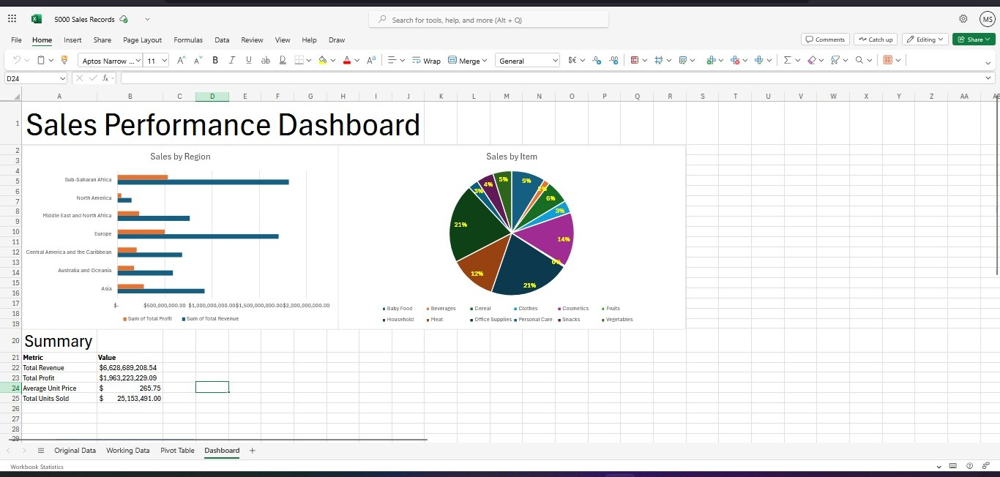
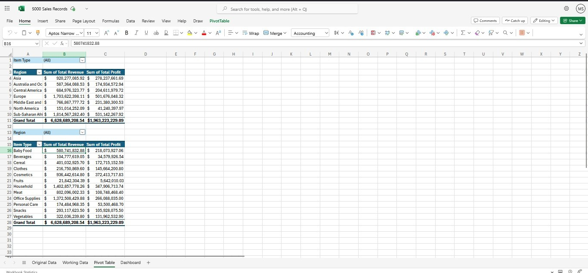

# 📊 Excel Sales Data Dashboard

This Excel project analyzes and visualizes 5,000 rows of global sales records. It includes data cleaning, summarization using pivot tables, and an interactive dashboard to extract meaningful business insights. Ideal for showcasing Excel proficiency in data analysis, visualization, and reporting.

## 📸 Screenshots

### Dashboard Overview

### Pivot Table Summary

## 📁 Project Structure

- **Original Data**: Raw sales transactions including product type, region, sales channel, units sold, and profits.
- **Working Data**: Processed and cleaned dataset prepared for analysis.
- **Pivot Table**: Summarized data showing key metrics like revenue and profit by region, product type, and channel.
- **Dashboard**: Visual dashboard with charts and KPIs to provide quick insights.

## 📌 Key Features

- Cleaned and organized over 5,000 records of real-world-style sales data
- Built pivot tables to analyze:
  - Sales performance by region and product
  - Revenue and profit trends
  - Online vs offline sales comparison
- Designed an Excel dashboard to highlight:
  - Top performing regions
  - Most profitable product categories
  - Sales channel performance over time

## 📎 Tools Used

- Microsoft Excel
- Pivot Tables
- Charts (Bar, Line, Pie)
- Slicers and Filters for interactivity

## 🧠 Skills Demonstrated

- Data cleaning and transformation
- Exploratory data analysis (EDA)
- Data visualization and dashboard design
- Business insights communication through Excel
